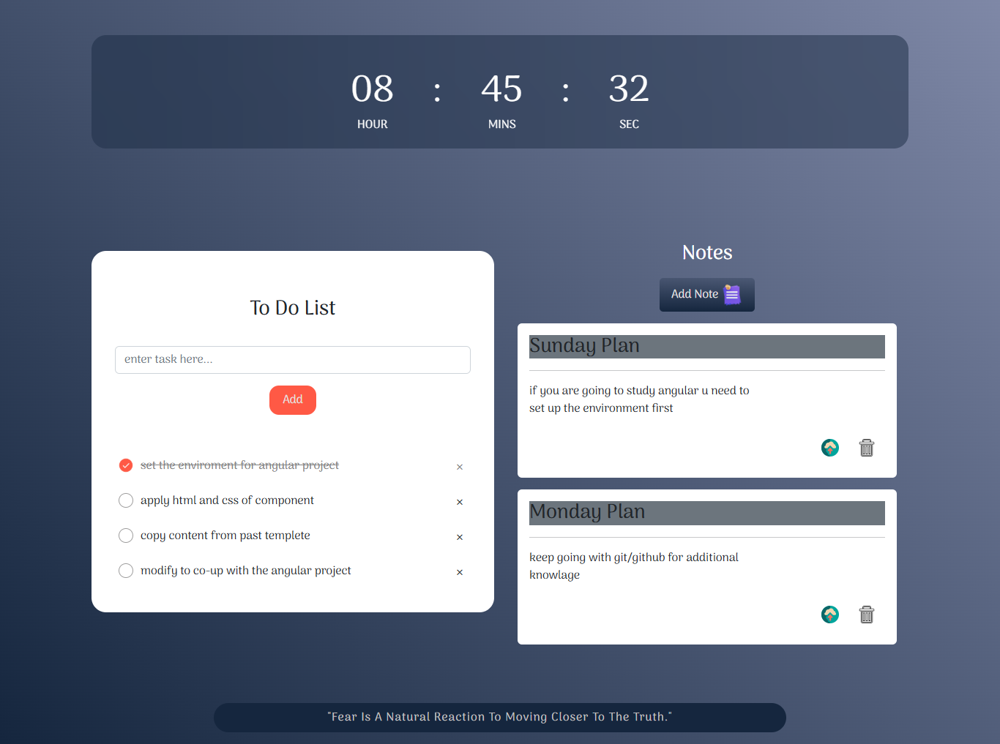

# 📝 Simple JavaScript To-Do Page

This project is a **vanilla JavaScript web page** 
that provides a simple and interactive experience with tasks, notes, live clock, and inspirational quotes.

---

## 🚀 Features

1. **⏰ Local Time Display**  
   - The first section displays the **current local time** that updates in real-time.

2. **✅ Tasks & Notes Manager**  
   - The second section is split into **two parts**:
     - **Tasks**: Add and manage your to-do tasks.
     - **Notes**: Add notes related to each task for better tracking.
   - All tasks and notes are stored using **Local Storage**, so data persists even after refreshing the page.

3. **💡 Random Quotes API**  
   - The last section makes an **API call** to fetch a random inspirational quote.  
   - A new quote is displayed every time the page is opened/refreshed.

---

## 🛠️ Tools & Technologies

- **HTML5**
- **CSS3**
- **Vanilla JavaScript (ES6+)**
- **Local Storage**
- **Quotes API** (random quotes)

