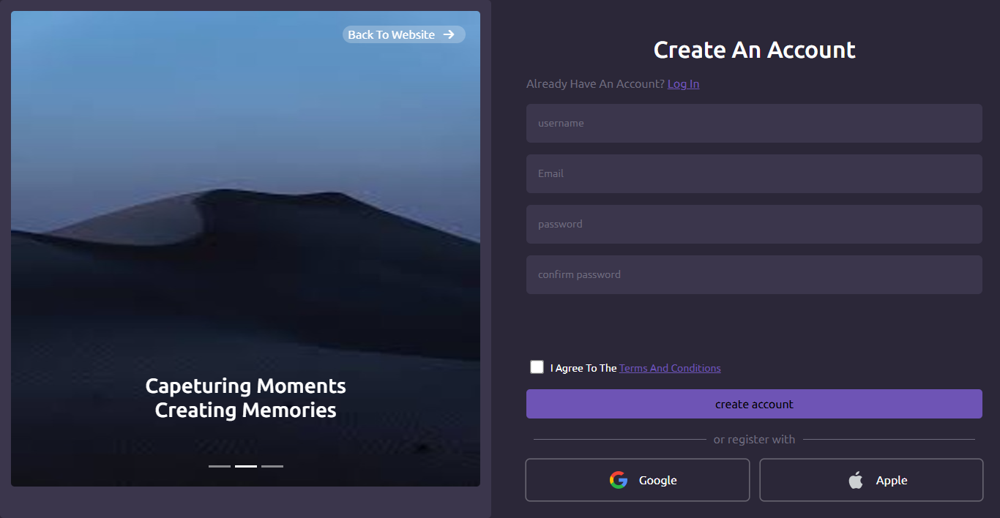
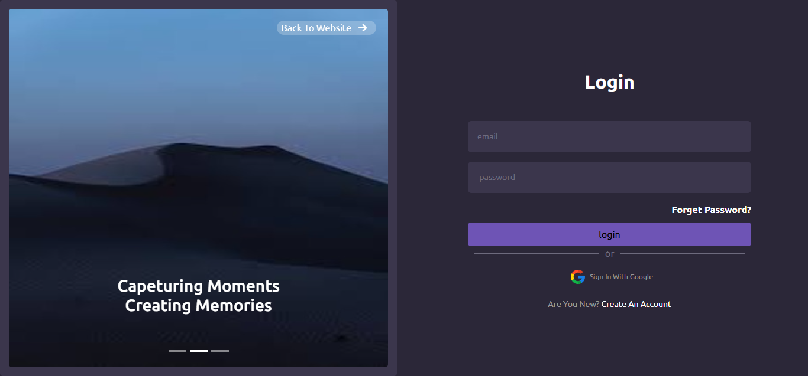
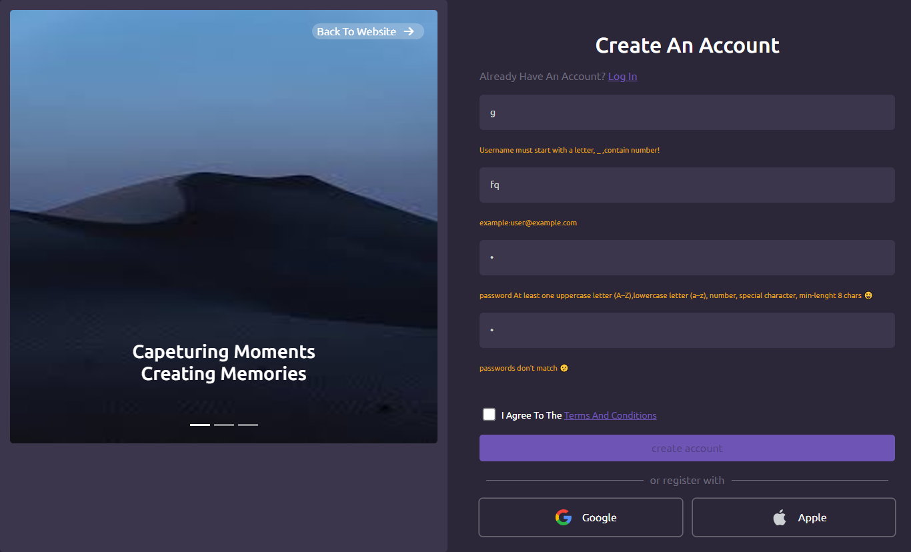

# 📝 User Authentication Project (Sign Up & Login)

This project is a simple **User Authentication System** built with **HTML, CSS, and JavaScript**.  
It provides **Sign Up** and **Login** functionalities, with live input validation using **Regex**.  
User data is stored in a JSON database and checked during login.

---

## 🚀 Features
- ✅ **Sign Up Form** with:
  - Username validation (must start with a letter, can contain numbers, `_`, `-`, not less than 4 chars).
  - Email validation (valid email format).
  - Password validation (strong password with uppercase, lowercase, number, and special character).
  - Confirm password check.
  - "Agree to terms" checkbox.
- ✅ **Login Form** with email & password check.
- ✅ **Validation messages** displayed under inputs.
- ✅ **Redirect to Home page** after successful login.

---

## 📸 UI Screenshots

### 🔹 Sign Up Screen
 

Explanation:
- **Username field** → must follow specific regex rules.  
- **Email field** → checks valid email structure.  
- **Password & Confirm Password** → must match and follow password rules.  
- **Sign Up Button** → disabled until all inputs are valid.  

---
This screen allows registered users to **log in** with their email and password.  
If credentials match the stored data, the user is redirected to the **Home Page**.

### 🔹 Regex Validation Rules (Sign Up Screen) 

Explanation of rules:
- **Username Regex** → `^(?=^[A-Za-z])(?=.*\d?)[A-Za-z0-9_-]{4,16}$`  
  - Must start with a letter  
  - Can include numbers (not at the start)  
  - Can include `_` or `-`  
  - Min length: 4  

- **Password Regex** → `^(?=.*\d)(?=.*[a-z])(?=.*[A-Z])(?=.*[\W_]).{7,}$`  
  - At least 1 number  
  - At least 1 uppercase & lowercase  
  - At least 1 special character  
  - Minimum length: 7  

---

## 📂 Project Structure
/login-access
│── /assets
│     └── /login
│          └── screan.png              # screenshot of login screen
│     └── /signup
│          └── ui-screan.png           # screenshot of signup UI
│          └── regex-validation.png    # screenshot of regex validation
│── /css
│     └── style.css
│── /js
│     └── login.js
│     └── signup.js
│     └── helper.js
│── /webfonts
│── home.html
│── login.html
│── signup.html
│── README.md

