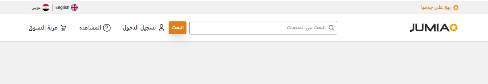
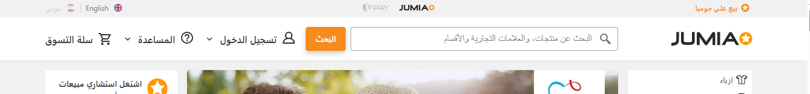

# Jumia Navbar & Topbar Simulation

This project is a simulation of the navbar and topbar from the official Jumia website. The goal is to recreate the look and feel of Jumia's global navigation using modern web technologies.

## Side-by-Side Comparison

| Demo Navbar | Original Navbar |
|:-----------:|:--------------:|
|  |  |

## Features

- Visual fidelity to the original Jumia navigation
- Responsive navbar similar to Jumia's official site
- Topbar with essential links and icons
- Clean and modular code structure

## Technologies Used

- HTML5
- CSS3
- JavaScript (optional for interactivity)

## Usage

1. Clone the repository.
2. Open `index.html` in your browser.
3. Explore the simulated Jumia navbar and topbar.

## Purpose

This project is intended for learning and demonstration purposes, showcasing how to replicate real-world website components.

