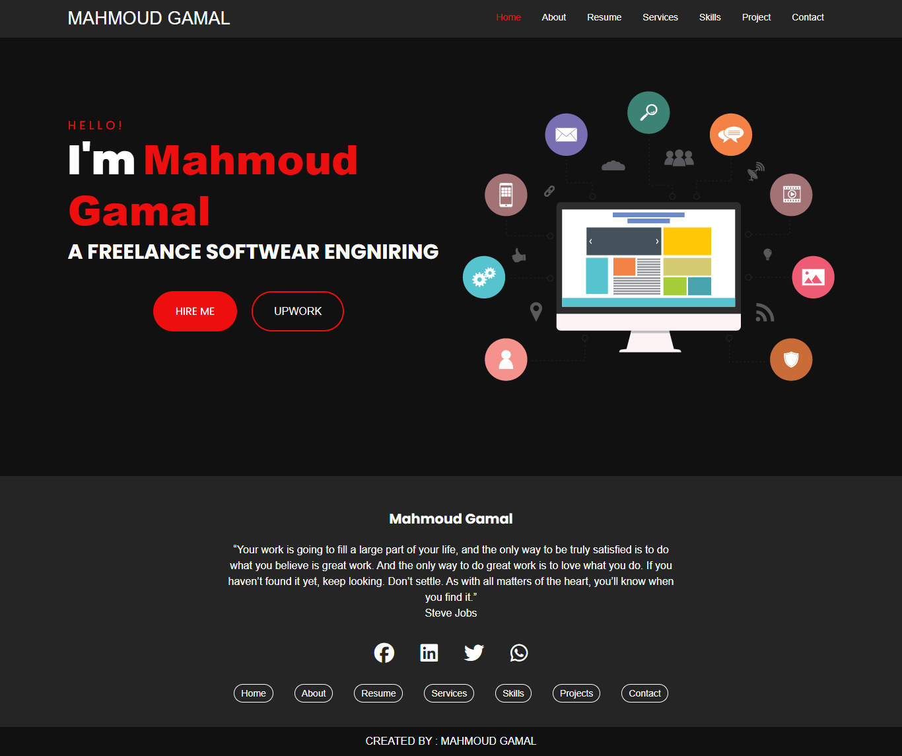
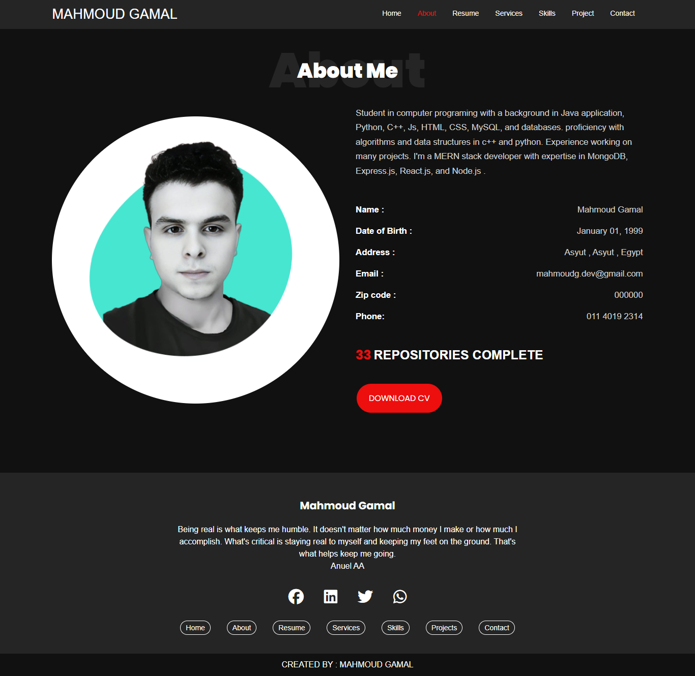
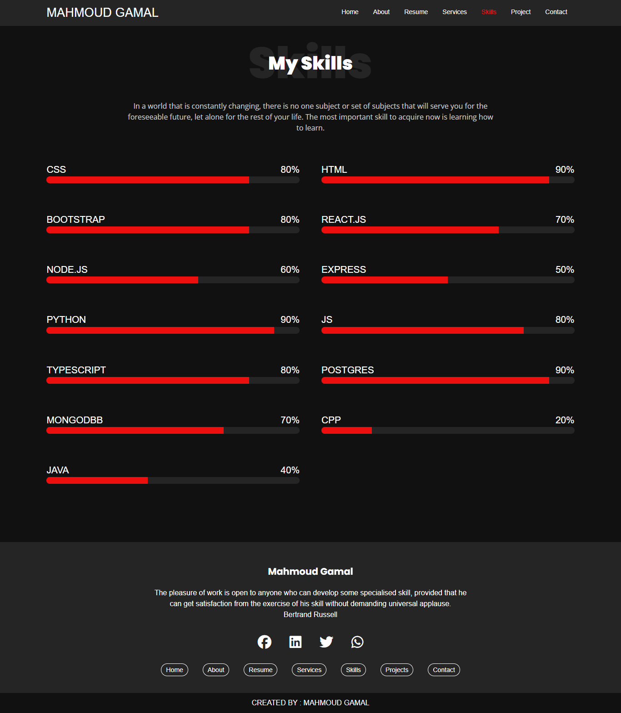
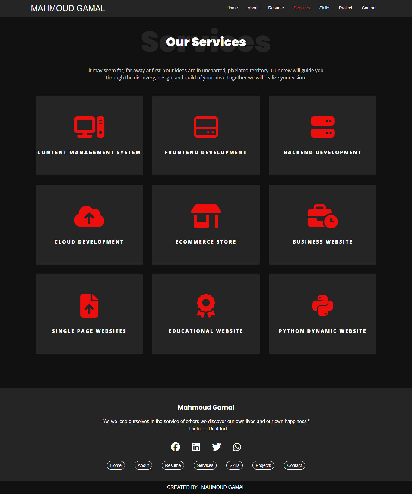
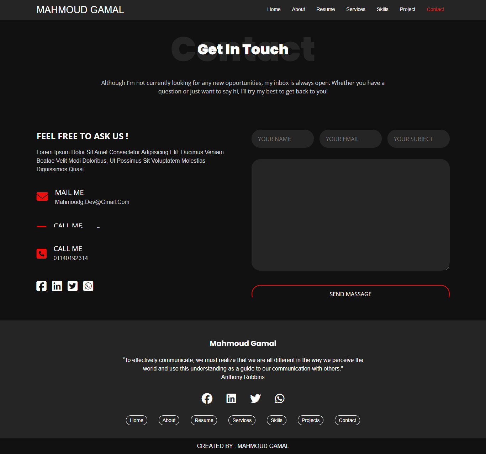

# Mahmoud Gamal Portfolio

Welcome to my personal portfolio website! This project showcases my skills, experience, and projects as a computer programming student and MERN stack developer.

## Features

- Responsive design for all devices
- About me section with personal details
- Downloadable CV
- Navigation bar for easy access to all pages
- Social media links
- Footer with inspirational quote

## Screenshots

### Home Page

### About Page

### Resume Page

### Services Page

### Contact Page

## Technologies Used

- HTML5
- CSS3
- JavaScript
- Font Awesome
- Google Fonts

